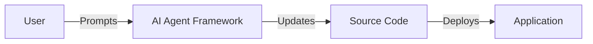
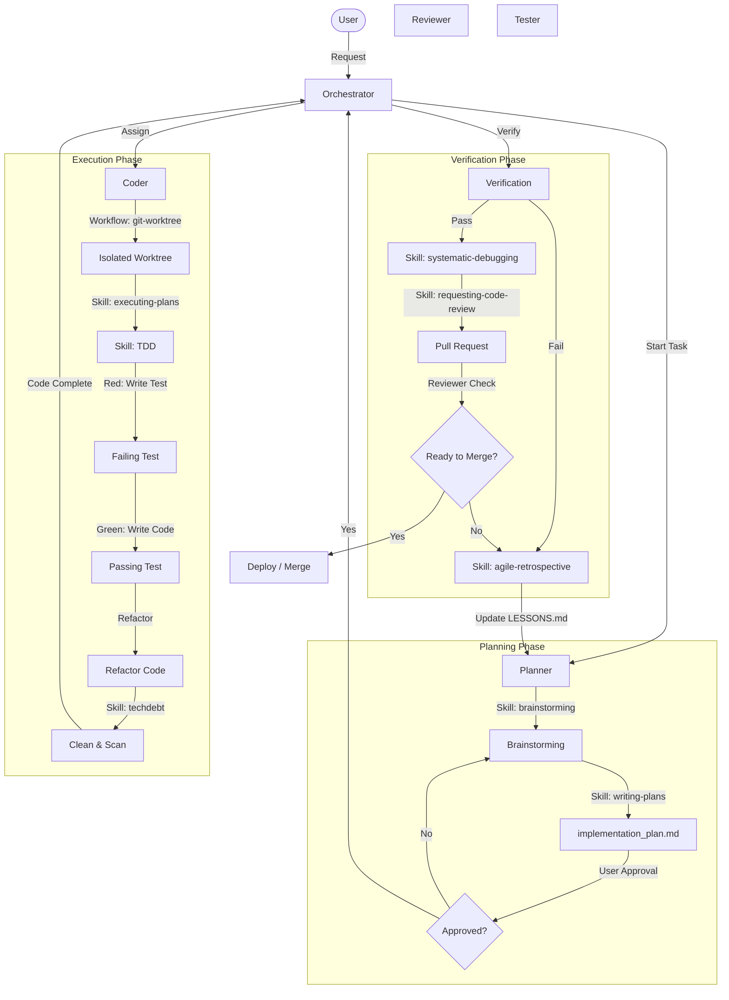

# AI Agent Framework


A modular, token-optimized agent architecture for AI-assisted software development.

> ** Sample Initiation AI Instruction**: refer to [GEMINI.md](./GEMINI.md) (for Gemini) or [CLAUDE.md](./CLAUDE.md) (for Claude) to initialize your role and protocols. Especially, refer to [README.md](./README.md) for the project overview.


## Features
- **Orchestrator Pattern**: Orchestrator delegates to specialized subagents
- **Shared State**: Central `SCRATCHPAD.md` for multi-agent coordination
- **Autonomous Iteration**: Ralph Wiggum technique for "ship code while you sleep"
- **Multi-Platform**: Supports Gemini/Antigravity and Claude Code
- **Token Optimized**: Concise index files save context window

## Architecture & Concepts
 
 ### Agents vs. Skills
 
 This framework distinguishes between **WHO** does the work (Agents) and **HOW** they do it (Skills).
 
 | Concept | Definition | Example |
 |---------|------------|---------|
 | **Agent** | A persona or role with specific responsibilities, constraints, and scope. Agents heavily rely on system prompts to define their behavior. | **Coder**, **Planner**, **Reviewer** |
 | **Skill** | A specific capability or procedure that an agent can invoke. Skills are tools or instruction sets used to accomplish a task. | **brainstorming**, **test-driven-development**, **git-commit** |
 
 ### Directory Structure Rationale
 
 - **`agent/`**: Contains the **Universal Logic**. This is the core definition of the agents (Orchestrator, Planner, etc.) and is platform-agnostic.
 - **`.gemini/` & `.claude/`**: Contain the **Platform Adapters**. These directories hold the specific configurations, hooks, and optimized skill prompts required to run the universal agents on Gemini or Claude respectively.
 
 ## Structure
```
.
├── GEMINI.md              # Project-specific index for Gemini
├── CLAUDE.md              # Project-specific index for Claude Code
├── README.md              # This file
├── agent/                 # Core agent definitions
│   ├── SCRATCHPAD.md      # Shared state (live blackboard)
│   ├── STANDARDS.md       # Coding standards for all agents
│   ├── workflows/         # Reusable agent workflows
│   │   └── iteration-loop.md
│   │   └── ralph_wiggum/      # Ralph Wiggum workflow tools
│   ├── orchestrator/      # Orchestrator
│   ├── planner/           # Specs + Architecture + Tasks
│   ├── code_reviewer/     # Quality (includes PR Review Toolkit)
│   ├── tester/            # Verification
│   ├── devops/            # Git + CI/CD + Checkpoints
│   ├── security/          # SBOM + Threat Model
│   ├── ui_ux/             # Design intelligence
│   ├── tech_writer/       # Documentation
│   └── feature_dev/       # Feature Development Team
├── .gemini/               # Gemini CLI configuration
│   ├── settings.json
│   ├── hooks/
│   └── skills/            # Gemini-specific skills
│       ├── SKILL_INDEX.md
│       ├── brainstorming/
│       ├── writing-plans/
│       └── ...
├── .claude/               # Claude Code configuration
│   ├── settings.local.json
│   ├── hooks/
│   └── skills/            # Claude-specific skills
│       ├── SKILL_INDEX.md
│       ├── brainstorming/
│       ├── writing-plans/
│       └── ...
└── .shared/               # Shared hooks & config
    └── blocked_commands.json
```

## Quick Start

### For Gemini / Antigravity
```
Read GEMINI.md. Act as the Orchestrator. Build a [feature].
```

### For Claude Code
```
Read CLAUDE.md. Act as the Orchestrator. Build a [feature].
```

### Autonomous Mode (Ralph Wiggum Technique)
```
/iteration-loop
"Implement [feature] until all tests pass"
```

## Applying to Your Project

To retrofit this framework into an existing project or use it in a new one:

### Global Integration (Gemini)

To install these agents and skills globally into your user configuration (`~/.gemini/`), run the installation script:

```bash
./install_gemini_global.sh
```

This will:
1.  Install skills to `~/.gemini/antigravity/global_skills`.
2.  Install agents and shared resources to `~/.gemini/extensions/coding-agent`.
3.  Automatically update the agent configurations to reference the global skill paths.

### Global Integration (Claude)

To install these agents and skills globally into your user configuration (`~/.claude/`), run the installation script:

```bash
./install_claude_global.sh
```

This will:
1.  Install skills to `~/.claude/skills` (referencable by Claude).
2.  Install agents to `~/.claude/extensions/coding-agent`.
3.  Update `~/.claude/CLAUDE.md` to reference the installed protocol.

### 1. Copy Framework Files
Copy the following directories and files to your project root. **DO NOT** copy the `.git` directory to avoid conflicts.

```bash
# Assuming you are in your project root
cp -R /path/to/Coding_Agent/agent .
cp -R /path/to/Coding_Agent/.gemini .
cp -R /path/to/Coding_Agent/.claude .
cp -R /path/to/Coding_Agent/.shared .

```

### 2. Configure Git Ignore
Add the following to your project's `.gitignore`. This ensures the agent framework remains a local overlay and doesn't pollute your project's repository.

```text
# Agent Framework (Local Overlay)
agent/
.gemini/
.claude/
.shared/
```

### 3. Handle Documentation Conflicts
Your project likely has its own `README.md`.
- **Do not overwrite** your project's `README.md` with instructions from this framework.
- **Action**: Manually update your project's `README.md` to include:
  1. A section illustrating the system architecture and flow (Required by `STANDARDS.md`).
  2. A brief mention that the AI Agent Framework is active locally.

#### Example Architecture Diagram
Add a mermaid chart to your project's README to visualize the flow:



---

## Software Development Flowchart



## 🚀 Team Productivity Playbook

We follow the [Team Productivity Playbook](docs/playbook/TEAM_PRODUCTIVITY.md) to maximize efficiency.

### Core Tenets
1.  **Do More in Parallel**: Use `agent/workflows/git-worktree.md` to run multiple agents in isolated worktrees.
2.  **Plan First**: Always start with a `Planner` and `implementation_plan.md`.
3.  **Self-Correcting Memory**: Use `agile-retrospective` to log lessons in `agent/memory/LESSONS.md`.
4.  **Skills Over Ad-Hoc**: Convert repetitive tasks to skills (e.g., `techdebt`).
5.  **Autonomous Iteration**: Use the `iteration-loop` for unattended coding.

### Key Tools
-   **`/techdebt` Skill**: Scans for TODOs and duplicates (`.gemini/skills/techdebt`).
-   **`/agile-retrospective` Skill**: Formalizes learning from failures.
-   **`git-worktree` Workflow**: Manage parallel tasks without repo pollution.
-   **`implementation_plan.md`**: The source of truth for execution.

### Autonomous Iteration Loop
For overnight/unattended sessions:
1. **Execute** current task from plan
2. **Verify** via tests, lint, build
3. **On Failure**: Log, adjust, retry (up to MAX_ITERATIONS)
4. **On Success**: Checkpoint commit, proceed to next task

## Key Files
| File | Purpose |
|------|---------|
| `GEMINI.md` | Project registry for Gemini |
| `CLAUDE.md` | Project registry for Claude |
| `agent/SCRATCHPAD.md` | Live state + iteration tracking |
| `agent/workflows/iteration-loop.md` | Autonomous loop workflow |

## Security Hooks (Claude Code & Gemini CLI)

Pre-execution hooks that block dangerous system commands for **both** Claude Code and Gemini CLI.

| File | Purpose |
|------|---------|
| `.shared/blocked_commands.json` | Single source of truth for all blocking rules |
| `.claude/settings.local.json` | Claude Code `PreToolUse` hook config |
| `.gemini/settings.json` | Gemini CLI `BeforeTool` hook config |

**Setup:** See [.claude/HOOK_SETUP.md](.claude/HOOK_SETUP.md)

**Blocks:** `rm -rf /`, `sudo rm/chmod/dd`, `curl|bash`, `git push --force`, deleting `.env`/`.git/`, etc.

### Skills (Workflow + Knowledge)

Skills are invoked by agents for structured workflows. Based on [obra/superpowers](https://github.com/obra/superpowers).

| Skill | Purpose | Iron Law |
|-------|---------|----------|
| **brainstorming** | Socratic design refinement | One question at a time |
| **writing-plans** | Bite-sized task plans | 2-5 min per step |
| **executing-plans** | Batch execution with checkpoints | Stop when blocked |
| **test-driven-development** | RED-GREEN-REFACTOR cycle | No code without failing test |
| **systematic-debugging** | 4-phase root cause analysis | No fixes without investigation |
| **requesting-code-review** | Two-stage review process | Review early, review often |
| **frontend-design** | Distinctive UI/UX guidelines | - |
| **explaining-code** | Code explanations with diagrams | - |
| **techdebt** | Scan for copy-paste, TODOs, and large files | - |
| **agile-retrospective** | Analyze successes/failures, update memory | - |

> **Note:** Skills are maintained separately for each agent platform:
> - **Gemini/Antigravity**: `.gemini/skills/`  
> - **Claude Code**: `.claude/skills/`
> 
> This allows each agent to have optimized skill instructions for their specific capabilities.

**Skill Invocation Pattern:**
```
1. Check .gemini/skills/SKILL_INDEX.md (Gemini) or .claude/skills/SKILL_INDEX.md (Claude)
2. Announce: "I'm using the [skill] skill to [purpose]."
3. Follow skill instructions exactly
```

### Antigravity Skills Setup

To enable skills in [Google Antigravity](https://antigravity.google/docs/skills), copy skills to your project:

```bash
# Copy skills to your project's .gemini/skills/ directory
cp -R /path/to/Coding_Agent/.gemini/skills /your/project/.gemini/skills
```

Each skill folder contains a `SKILL.md` with YAML frontmatter:
```yaml
---
name: skill-name
description: "When to use this skill..."
---
# Skill instructions in markdown
```

See [Antigravity Skills Documentation](https://antigravity.google/docs/skills) for more details.

### Directory Structure
```
.gemini/skills/              # Gemini-specific skills
├── SKILL_INDEX.md
├── brainstorming/
├── writing-plans/
├── ...

.claude/skills/              # Claude-specific skills
├── SKILL_INDEX.md
├── brainstorming/
├── writing-plans/
└── ...
```

**Add a skill:**
```bash
# For Gemini
mkdir .gemini/skills/my-skill
# Create SKILL.md with frontmatter (name, description) + instructions

# For Claude
mkdir .claude/skills/my-skill
# Create SKILL.md with the same format
```

## References

- **Superpowers Skills**: [obra/superpowers](https://github.com/obra/superpowers) - Claude Code superpowers: core skills library
- **Ralph Wiggum Technique**: [Autonomous iteration loop for AI agents](https://www.reddit.com/r/ClaudeAI/comments/1i1vz5h/claude_will_code_for_you_while_you_sleep_if_you/) - Reddit post by u/ProfessionalFar5209
- **PR Review Toolkit**: Inspired by [Harper Carroll's PR Review agents](https://github.com/g0t4/prompt-engineers-only/tree/main) - Prompt Engineers Only
- **Multi-Agent Orchestration**: [Anthropic's agentic patterns](https://www.anthropic.com/engineering/building-effective-agents) - Building Effective Agents
- **KERNEL Prompt Framework**: [Prompt engineering best practices](https://www.reddit.com/r/ClaudeAI/comments/1i1k5xm/kernel_a_prompt_engineering_framework_based_on/) - Reddit post
- **Claude Code Hooks**: [Official Claude Code hooks documentation](https://docs.anthropic.com/en/docs/claude-code/hooks)
- **Gemini CLI**: [Google Gemini CLI documentation](https://github.com/google-gemini/gemini-cli)
- **Skills for Claude Code**: [Official Claude Code skills documentation](https://docs.anthropic.com/en/docs/claude-code/skills)

## License
MIT
