# AI Agent Framework


A modular, token-optimized agent architecture for AI-assisted software development.

> ** Sample Initiation AI Instruction**: refer to [GEMINI.md](./GEMINI.md) (for Gemini) or [CLAUDE.md](./CLAUDE.md) (for Claude) to initialize your role and protocols. Especially, refer to [README.md](./README.md) for the project overview.


## Features
- **Orchestrator Pattern**: Orchestrator delegates to specialized subagents
- **Shared State**: Central `SCRATCHPAD.md` for multi-agent coordination
- **Autonomous Iteration**: Ralph Wiggum technique for "ship code while you sleep"
- **Multi-Platform**: Supports Gemini/Antigravity and Claude Code
- **Token Optimized**: Concise index files save context window

## Structure
```
.
├── GEMINI.md              # Index for Gemini agents
├── CLAUDE.md              # Index for Claude Code agents
├── README.md              # This file
├── .agents/               # Core agent definitions
│   ├── SCRATCHPAD.md      # Shared state (live blackboard)
│   ├── STANDARDS.md       # Coding standards for all agents
│   ├── workflows/         # Reusable agent workflows
│   │   └── iteration-loop.md
│   ├── orchestrator/      # Orchestrator
│   ├── planner/           # Specs + Architecture + Tasks
│   ├── code_reviewer/     # Quality
│   ├── tester/            # Verification
│   ├── devops/            # Git + CI/CD + Checkpoints
│   ├── security/          # SBOM + Threat Model
│   ├── ui_ux/             # Design intelligence
│   └── tech_writer/       # Documentation
├── .gemini/               # Gemini CLI configuration
│   ├── settings.json
│   ├── hooks/
│   └── skills/            # Gemini-specific skills
│       ├── SKILL_INDEX.md
│       ├── brainstorming/
│       ├── writing-plans/
│       └── ...
├── .claude/               # Claude Code configuration
│   ├── settings.local.json
│   ├── hooks/
│   └── skills/            # Claude-specific skills
│       ├── SKILL_INDEX.md
│       ├── brainstorming/
│       ├── writing-plans/
│       └── ...
└── .shared/               # Shared plugins & hooks
    ├── blocked_commands.json
    └── plugins/           # Slash commands + agents
        ├── ralph-wiggum/
        ├── pr-review-toolkit/
        ├── feature-dev/
        └── frontend-design/
```

## Quick Start

### For Gemini / Antigravity
```
Read GEMINI.md. Act as the Orchestrator. Build a [feature].
```

### For Claude Code
```
Read CLAUDE.md. Act as the Orchestrator. Build a [feature].
```

### Autonomous Mode (Ralph Wiggum Technique)
```
/iteration-loop
"Implement [feature] until all tests pass"
```

## Applying to Your Project

To retrofit this framework into an existing project or use it in a new one:

### Global Integration (Gemini)

To install these agents and skills globally into your user configuration (`~/.gemini/`), run the installation script:

```bash
./install_gemini_global.sh
```

This will:
1.  Install skills to `~/.gemini/antigravity/global_skills`.
2.  Install agents and shared resources to `~/.gemini/extensions/coding-agent`.
3.  Automatically update the agent configurations to reference the global skill paths.

### 1. Copy Framework Files
Copy the following directories and files to your project root. **DO NOT** copy the `.git` directory to avoid conflicts.

```bash
# Assuming you are in your project root
cp -R /path/to/Coding_Agent/.agents .
cp -R /path/to/Coding_Agent/.gemini .
cp -R /path/to/Coding_Agent/.claude .
cp -R /path/to/Coding_Agent/.shared .
cp /path/to/Coding_Agent/CLAUDE.md .
cp /path/to/Coding_Agent/GEMINI.md .
```

### 2. Configure Git Ignore
Add the following to your project's `.gitignore`. This ensures the agent framework remains a local overlay and doesn't pollute your project's repository.

```text
# Agent Framework (Local Overlay)
.agents/
.gemini/
.claude/
.shared/
CLAUDE.md
GEMINI.md
```

### 3. Handle Documentation Conflicts
Your project likely has its own `README.md`.
- **Do not overwrite** your project's `README.md` with instructions from this framework.
- **Action**: Manually update your project's `README.md` to include:
  1. A section illustrating the system architecture and flow (Required by `STANDARDS.md`).
  2. A brief mention that the AI Agent Framework is active locally.

#### Example Architecture Diagram
Add a mermaid chart to your project's README to visualize the flow:


---

## Workflow

```mermaid
flowchart TD
    subgraph Planning
        A[📋 Orchestrator] --> B[🧠 Planner]
        B --> C["specs/ + design/"]
    end

    subgraph Execution
        A --> D[💻 Coder]
        D --> E[📝 Code Changes]
    end

    subgraph Verification
        E --> F[🔍 Reviewer]
        E --> G[🧪 Tester]
        F --> H{Pass?}
        G --> H
    end

    subgraph Completion
        H -->|Yes| I[📖 Tech Writer]
        H -->|No| D
        I --> J[✅ Done]
    end

    subgraph Autonomous Loop
        K[Execute Task] --> L[Verify]
        L -->|Fail| M[Log + Retry]
        M --> K
        L -->|Pass| N[Checkpoint Commit]
        N --> O{More Tasks?}
        O -->|Yes| K
        O -->|No| J
    end
```



1. **Orchestrator** reads the index file (`GEMINI.md` or `CLAUDE.md`)
2. **Orchestrator** calls **Planner** → outputs `specs/` and `design/`
3. **Orchestrator** assigns tasks to **Coders**
4. **Orchestrator** calls **Reviewer** + **Tester** to verify
5. **Orchestrator** calls **Tech Writer** to update docs

### Autonomous Iteration Loop
For overnight/unattended sessions:
1. **Execute** current task from plan
2. **Verify** via tests, lint, build
3. **On Failure**: Log, adjust, retry (up to MAX_ITERATIONS)
4. **On Success**: Checkpoint commit, proceed to next task

## Key Files
| File | Purpose |
|------|---------|
| `GEMINI.md` | Agent registry for Gemini |
| `CLAUDE.md` | Agent registry for Claude |
| `.agents/SCRATCHPAD.md` | Live state + iteration tracking |
| `.agents/workflows/iteration-loop.md` | Autonomous loop workflow |

## Security Hooks (Claude Code & Gemini CLI)

Pre-execution hooks that block dangerous system commands for **both** Claude Code and Gemini CLI.

| File | Purpose |
|------|---------|
| `.shared/blocked_commands.json` | Single source of truth for all blocking rules |
| `.claude/settings.local.json` | Claude Code `PreToolUse` hook config |
| `.gemini/settings.json` | Gemini CLI `BeforeTool` hook config |

**Setup:** See [.claude/HOOK_SETUP.md](.claude/HOOK_SETUP.md)

**Blocks:** `rm -rf /`, `sudo rm/chmod/dd`, `curl|bash`, `git push --force`, deleting `.env`/`.git/`, etc.

## Shared Plugins & Skills

Plugins and skills are shared between Claude Code and Gemini CLI via `.shared/`.

### Plugins (Commands + Agents)

Plugins provide slash commands (`/command`) and specialized agents. Trigger with `/`:

| Plugin | Command | Description |
|--------|---------|-------------|
| **ralph-wiggum** | `/ralph-loop` | Iterative development loops (Ralph Wiggum technique) |
| **pr-review-toolkit** | `/review-pr` | Comprehensive PR review with 6 specialized agents |
| **feature-dev** | `/feature-dev` | Guided feature development workflow |

#### PR Review Toolkit Agents
```
/review-pr              # Full review
/review-pr tests errors # Specific aspects
```
- `code-reviewer` - Project guidelines compliance
- `code-simplifier` - Code clarity and maintainability
- `comment-analyzer` - Comment accuracy
- `pr-test-analyzer` - Test coverage quality
- `silent-failure-hunter` - Hidden error detection
- `type-design-analyzer` - Type encapsulation

#### Feature Dev Agents
```
/feature-dev Build a REST API
```
- `code-architect` - Design architectures
- `code-explorer` - Analyze existing code
- `code-reviewer` - Quality review

### Skills (Workflow + Knowledge)

Skills are invoked by agents for structured workflows. Based on [obra/superpowers](https://github.com/obra/superpowers).

| Skill | Purpose | Iron Law |
|-------|---------|----------|
| **brainstorming** | Socratic design refinement | One question at a time |
| **writing-plans** | Bite-sized task plans | 2-5 min per step |
| **executing-plans** | Batch execution with checkpoints | Stop when blocked |
| **test-driven-development** | RED-GREEN-REFACTOR cycle | No code without failing test |
| **systematic-debugging** | 4-phase root cause analysis | No fixes without investigation |
| **requesting-code-review** | Two-stage review process | Review early, review often |
| **frontend-design** | Distinctive UI/UX guidelines | - |
| **explaining-code** | Code explanations with diagrams | - |

> **Note:** Skills are maintained separately for each agent platform:
> - **Gemini/Antigravity**: `.gemini/skills/`  
> - **Claude Code**: `.claude/skills/`
> 
> This allows each agent to have optimized skill instructions for their specific capabilities.

**Skill Invocation Pattern:**
```
1. Check .gemini/skills/SKILL_INDEX.md (Gemini) or .claude/skills/SKILL_INDEX.md (Claude)
2. Announce: "I'm using the [skill] skill to [purpose]."
3. Follow skill instructions exactly
```

### Antigravity Skills Setup

To enable skills in [Google Antigravity](https://antigravity.google/docs/skills), copy skills to your project:

```bash
# Copy skills to your project's .gemini/skills/ directory
cp -R /path/to/Coding_Agent/.gemini/skills /your/project/.gemini/skills
```

Each skill folder contains a `SKILL.md` with YAML frontmatter:
```yaml
---
name: skill-name
description: "When to use this skill..."
---
# Skill instructions in markdown
```

See [Antigravity Skills Documentation](https://antigravity.google/docs/skills) for more details.

### Directory Structure
```
.gemini/skills/              # Gemini-specific skills
├── SKILL_INDEX.md
├── brainstorming/
├── writing-plans/
├── ...

.claude/skills/              # Claude-specific skills
├── SKILL_INDEX.md
├── brainstorming/
├── writing-plans/
└── ...

.shared/plugins/             # Shared plugins (commands + agents)
├── ralph-wiggum/
├── pr-review-toolkit/
├── feature-dev/
└── frontend-design/
```

**Add a skill:**
```bash
# For Gemini
mkdir .gemini/skills/my-skill
# Create SKILL.md with frontmatter (name, description) + instructions

# For Claude
mkdir .claude/skills/my-skill
# Create SKILL.md with the same format
```

## References

- **Superpowers Skills**: [obra/superpowers](https://github.com/obra/superpowers) - Claude Code superpowers: core skills library
- **Ralph Wiggum Technique**: [Autonomous iteration loop for AI agents](https://www.reddit.com/r/ClaudeAI/comments/1i1vz5h/claude_will_code_for_you_while_you_sleep_if_you/) - Reddit post by u/ProfessionalFar5209
- **PR Review Toolkit**: Inspired by [Harper Carroll's PR Review agents](https://github.com/g0t4/prompt-engineers-only/tree/main) - Prompt Engineers Only
- **Multi-Agent Orchestration**: [Anthropic's agentic patterns](https://www.anthropic.com/engineering/building-effective-agents) - Building Effective Agents
- **KERNEL Prompt Framework**: [Prompt engineering best practices](https://www.reddit.com/r/ClaudeAI/comments/1i1k5xm/kernel_a_prompt_engineering_framework_based_on/) - Reddit post
- **Claude Code Hooks**: [Official Claude Code hooks documentation](https://docs.anthropic.com/en/docs/claude-code/hooks)
- **Gemini CLI**: [Google Gemini CLI documentation](https://github.com/google-gemini/gemini-cli)
- **Skills for Claude Code**: [Official Claude Code skills documentation](https://docs.anthropic.com/en/docs/claude-code/skills)

## License
MIT
