# AI Agent Framework

A modular, token-optimized agent architecture for AI-assisted software development.

## Features
- **Orchestrator Pattern**: Orchestrator delegates to specialized subagents
- **Shared State**: Central `SCRATCHPAD.md` for multi-agent coordination
- **Autonomous Iteration**: Ralph Wiggum technique for "ship code while you sleep"
- **Multi-Platform**: Supports Gemini/Antigravity and Claude Code
- **Token Optimized**: Concise index files save context window

## Structure
```
.
├── GEMINI.md              # Index for Gemini agents
├── CLAUDE.md              # Index for Claude Code agents
├── README.md              # This file
└── .agents/
    ├── SCRATCHPAD.md      # Shared state (live blackboard)
    ├── STANDARDS.md       # Coding standards for all agents
    ├── workflows/         # Reusable agent workflows
    │   └── iteration-loop.md
    ├── orchestrator/      # Orchestrator
    ├── planner/           # Specs + Architecture + Tasks
    ├── code_reviewer/     # Quality
    ├── tester/            # Verification
    ├── devops/            # Git + CI/CD + Checkpoints
    ├── security/          # SBOM + Threat Model
    ├── ui_ux/             # Design intelligence
    └── tech_writer/       # Documentation
```

## Quick Start

### For Gemini / Antigravity
```
Read GEMINI.md. Act as the Orchestrator. Build a [feature].
```

### For Claude Code
```
Read CLAUDE.md. Act as the Orchestrator. Build a [feature].
```

### Autonomous Mode (Ralph Wiggum Technique)
```
/iteration-loop
"Implement [feature] until all tests pass"
```

## Workflow

```mermaid
flowchart TD
    subgraph Planning
        A[📋 Orchestrator] --> B[🧠 Planner]
        B --> C["specs/ + design/"]
    end

    subgraph Execution
        A --> D[💻 Coder]
        D --> E[📝 Code Changes]
    end

    subgraph Verification
        E --> F[🔍 Reviewer]
        E --> G[🧪 Tester]
        F --> H{Pass?}
        G --> H
    end

    subgraph Completion
        H -->|Yes| I[📖 Tech Writer]
        H -->|No| D
        I --> J[✅ Done]
    end

    subgraph Autonomous Loop
        K[Execute Task] --> L[Verify]
        L -->|Fail| M[Log + Retry]
        M --> K
        L -->|Pass| N[Checkpoint Commit]
        N --> O{More Tasks?}
        O -->|Yes| K
        O -->|No| J
    end
```



1. **Orchestrator** reads the index file (`GEMINI.md` or `CLAUDE.md`)
2. **Orchestrator** calls **Planner** → outputs `specs/` and `design/`
3. **Orchestrator** assigns tasks to **Coders**
4. **Orchestrator** calls **Reviewer** + **Tester** to verify
5. **Orchestrator** calls **Tech Writer** to update docs

### Autonomous Iteration Loop
For overnight/unattended sessions:
1. **Execute** current task from plan
2. **Verify** via tests, lint, build
3. **On Failure**: Log, adjust, retry (up to MAX_ITERATIONS)
4. **On Success**: Checkpoint commit, proceed to next task

## Key Files
| File | Purpose |
|------|---------|
| `GEMINI.md` | Agent registry for Gemini |
| `CLAUDE.md` | Agent registry for Claude |
| `.agents/SCRATCHPAD.md` | Live state + iteration tracking |
| `.agents/workflows/iteration-loop.md` | Autonomous loop workflow |

## Security Hooks (Claude Code & Gemini CLI)

Pre-execution hooks that block dangerous system commands for **both** Claude Code and Gemini CLI.

| File | Purpose |
|------|---------|
| `.shared/blocked_commands.json` | Single source of truth for all blocking rules |
| `.claude/settings.local.json` | Claude Code `PreToolUse` hook config |
| `.gemini/settings.json` | Gemini CLI `BeforeTool` hook config |

**Setup:** See [.claude/HOOK_SETUP.md](.claude/HOOK_SETUP.md)

**Blocks:** `rm -rf /`, `sudo rm/chmod/dd`, `curl|bash`, `git push --force`, deleting `.env`/`.git/`, etc.

## Shared Plugins & Skills

Plugins and skills are shared between Claude Code and Gemini CLI via `.shared/`.

### Plugins (Commands + Agents)

Plugins provide slash commands (`/command`) and specialized agents. Trigger with `/`:

| Plugin | Command | Description |
|--------|---------|-------------|
| **ralph-wiggum** | `/ralph-loop` | Iterative development loops (Ralph Wiggum technique) |
| **pr-review-toolkit** | `/review-pr` | Comprehensive PR review with 6 specialized agents |
| **feature-dev** | `/feature-dev` | Guided feature development workflow |

#### PR Review Toolkit Agents
```
/review-pr              # Full review
/review-pr tests errors # Specific aspects
```
- `code-reviewer` - Project guidelines compliance
- `code-simplifier` - Code clarity and maintainability
- `comment-analyzer` - Comment accuracy
- `pr-test-analyzer` - Test coverage quality
- `silent-failure-hunter` - Hidden error detection
- `type-design-analyzer` - Type encapsulation

#### Feature Dev Agents
```
/feature-dev Build a REST API
```
- `code-architect` - Design architectures
- `code-explorer` - Analyze existing code
- `code-reviewer` - Quality review

### Skills (Knowledge/Reference)

Skills are passive knowledge bases referenced by agents or users:

| Skill | Purpose |
|-------|---------|
| **frontend-design** | Distinctive UI/UX implementation guidelines |

**Use a skill:**
```
"Build a dashboard using the frontend-design skill"
```

### Directory Structure
```
.shared/
├── plugins/
│   ├── ralph-wiggum/     # Iterative loops
│   ├── pr-review-toolkit/ # PR review
│   ├── feature-dev/      # Feature development
│   └── frontend-design/  # (manifest only)
└── skills/
    └── frontend-design/  # UI/UX skill
```

**Add a plugin:**
```bash
mkdir -p .shared/plugins/my-plugin/commands
# Create plugin.json manifest
# Add command .md files with YAML frontmatter
```

**Add a skill:**
```bash
mkdir .shared/skills/my-skill
# Create SKILL.md with frontmatter (name, description) + instructions
```

## References

- **Ralph Wiggum Technique**: [Autonomous iteration loop for AI agents](https://www.reddit.com/r/ClaudeAI/comments/1i1vz5h/claude_will_code_for_you_while_you_sleep_if_you/) - Reddit post by u/ProfessionalFar5209
- **PR Review Toolkit**: Inspired by [Harper Carroll's PR Review agents](https://github.com/g0t4/prompt-engineers-only/tree/main) - Prompt Engineers Only
- **Multi-Agent Orchestration**: [Anthropic's agentic patterns](https://www.anthropic.com/engineering/building-effective-agents) - Building Effective Agents
- **KERNEL Prompt Framework**: [Prompt engineering best practices](https://www.reddit.com/r/ClaudeAI/comments/1i1k5xm/kernel_a_prompt_engineering_framework_based_on/) - Reddit post
- **Claude Code Hooks**: [Official Claude Code hooks documentation](https://docs.anthropic.com/en/docs/claude-code/hooks)
- **Gemini CLI**: [Google Gemini CLI documentation](https://github.com/google-gemini/gemini-cli)

## License
MIT
